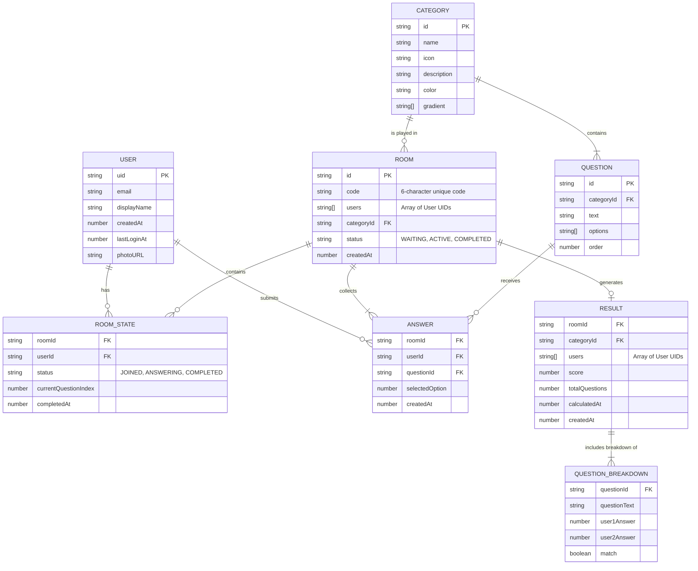

# SyncUs Entity-Relationship (ER) Diagram

Based on the core types in your application (`src/types/index.ts`), here is the Entity-Relationship Diagram detailing how the main data structures connect.

## Entity Details

- **USER**: The core profile for each person using the app. Logged in and authenticated via email.
- **CATEGORY**: Pre-defined themes (e.g., "Relationships", "Future Goals") that contain a set of questions.
- **QUESTION**: Individual questions belonging to a specific category.
- **ROOM**: Represents a game session between two users. It holds the chosen category and tracks the high-level progression state.
- **ROOM_STATE**: Represents an individual user's state *within* a specific room (whether they are joined, currently answering questions, or finished).
- **ANSWER**: Captures a single user's response to a specific question inside a given room.
- **RESULT**: The final aggregated data for a completed room. It calculates the final score and has an embedded array of **QUESTION_BREAKDOWN** objects representing the side-by-side comparison of user answers. 
