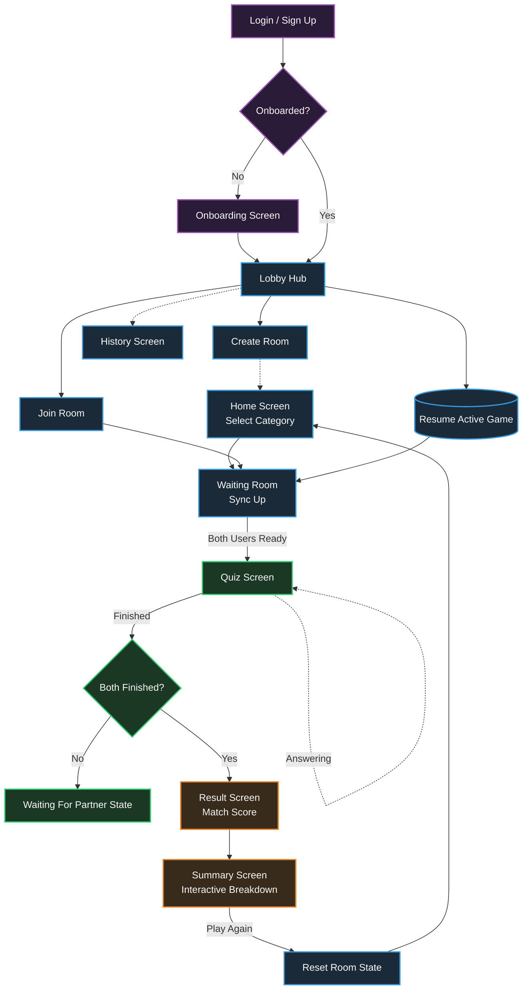

# SyncUs Features & Application Flow

SyncUs is a real-time couple's compatibility quiz application built with React Native and Firebase. It allows couples to answer simultaneous questions and instantly compare their results to see how well they match.

## 🌟 Core Features

### 1. User Management & Authentication
*   **Email & Password Authentication**: Secure user login and registration.
*   **Onboarding Flow**: Dedicated profile setup ensuring users have a display name and necessary profile metadata before joining matches.
*   **Persistent Sessions**: Users stay logged in across application restarts.

### 2. Real-Time Multiplayer Rooms
*   **Room Creation & Joining**: Users can generate a unique 6-character room code or join an existing room via a partner's code.
*   **Lobby Hub**: A central hub serving as the entry point for starting new rooms, re-joining active sessions, or checking history.
*   **Synchronized Waiting Room**: Real-time Firebase presence keeps track of when both users have joined and are ready to play.

### 3. Dynamic Quiz Engine
*   **Categorized Quizzes**: Questions are grouped into distinct themes (e.g., "Relationship Basics", "Future Goals").
*   **Simultaneous Gameplay**: Both partners answer questions asynchronously without seeing the other's answers until the end.
*   **Real-time Partner Status**: See when your partner is still answering or has completed the quiz.

### 4. Detailed Results & Analytics
*   **Compatibility Scoring**: Calculates a percentage match based on perfectly aligned answers.
*   **Question Breakdown**: The Summary Screen provides a detailed, side-by-side comparison of each partner's selected answers for deep-dive discussions.
*   **History Logs**: Saved records of past quizzes so couples can look back at their previous scores.

### 5. Seamless Reconnection & Multi-Round Support
*   **Resume Capability**: Players who accidentally drop out can resume their active quiz seamlessly from the Lobby.
*   **Play Again Loop**: Allows couples to choose new categories without re-establishing a room connection, resetting state correctly for the next round.

---

## 🧭 Application Flow

The following diagram illustrates the navigational flow users take through the application:

