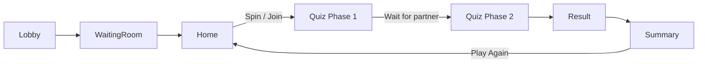

# SyncUs — Inconsistent State Analysis & Approaches

## Flow Recap



---

## 🔴 Critical — Can Leave App Broken

### 1. App Crash / Force-Close Mid-Quiz

| | |
|---|---|
| **What happens** | User's `roomState` stays `ANSWERING` or `GUESSING` in Firestore forever. Partner waits indefinitely on "Waiting for partner…" screen. |
| **Root cause** | No heartbeat or TTL on room states. The app only updates state on explicit user actions. |
| **Impact** | Partner is permanently stuck. Only fix today: manually edit Firestore. |

**Approach: Heartbeat + Stale Detection**

- Write a `lastSeen` timestamp to the user's `roomState` doc every ~30s while the quiz is active.
- On the "Waiting for partner…" screen, check if partner's `lastSeen` is older than 60s.
- If stale, show a **"Partner may have disconnected"** banner with a **"Continue Alone"** or **"Go Home"** option that resets both states.

```
Difficulty: Medium  |  Files: useQuiz.ts, QuizScreen.tsx, ResultScreen.tsx, quizService.ts
```

---

### 2. Network Drops During Answer Submission

| | |
|---|---|
| **What happens** | `handleAnswer` uses optimistic UI — it calls `nextQuestion()` immediately, then fires Firestore writes in background. If the network is down, those writes silently fail (`console.error` only). |
| **Root cause** | Fire-and-forget `syncBackground()` in [useQuiz.ts:55-86](file:///c:/rn/SyncUs/src/hooks/useQuiz.ts#L55-L86). No retry, no queue, no offline indicator. |
| **Impact** | User finishes the quiz locally, but Firestore has incomplete answers. Phase 2 guessing uses stale/missing data. Results are wrong. |

**Approach: Write Queue with Retry**

- Maintain a local queue (Zustand or AsyncStorage) of pending Firestore writes.
- On each write failure, push to the retry queue.
- Add a background interval that flushes the queue when connectivity returns.
- Show a subtle offline indicator in the quiz header when the device is offline (use `@react-native-community/netinfo`).
- On the "Waiting for partner" screen, flush the queue before transitioning to Phase 2.

```
Difficulty: High  |  Files: new retryQueue service, useQuiz.ts, QuizScreen.tsx
```

**Simpler alternative:** Before transitioning to Phase 2 (the "Ready to guess?" screen), verify that all answers exist in Firestore using `batchSubmitAnswers` as a reconciliation step. This is already partially done — `batchSubmitAnswers` is called on the last question — but it should be a **gating check**, not a background fire.

---

### 3. Partner Leaves Room While User Is in Quiz

| | |
|---|---|
| **What happens** | Partner calls `leaveRoom()` → room status becomes `COMPLETED`. User is still on QuizScreen with no awareness. They finish the quiz, hit Result screen, and wait forever for a partner who has already left. |
| **Root cause** | QuizScreen and ResultScreen don't listen to `room.status` changes. Only `partnerStatus` is monitored. |
| **Impact** | User stuck on "Waiting for partner to finish…" screen forever. |

**Approach: Room Status Listener**

- In QuizScreen and ResultScreen, watch `room?.status` via the existing `useRoom` hook.
- If `room.status` becomes `COMPLETED` while the user is mid-quiz:
  - Show an alert: **"Your partner left the room."**
  - Navigate back to Lobby and clean up state.

```
Difficulty: Low  |  Files: QuizScreen.tsx, ResultScreen.tsx
```

---

## 🟠 High — Bad UX, Recoverable

### 4. Both Partners Spin the Wheel Simultaneously

| | |
|---|---|
| **What happens** | Both partners open the spin wheel at the same time. Both spin. Both call `updateRoomCategory()` with different categories. Last write wins — one partner plays category A, the other plays category B (via `room.categoryId`). |
| **Root cause** | No lock or check-and-set on `room.categoryId`. The spin-to-start flow has no coordination. |
| **Impact** | Partners answer different question sets. Phase 2 guessing and results are completely wrong. |

**Approach A: Optimistic Lock**

- Before writing the category, read `room.categoryId`. If it's already set (non-empty) and the partner's status is not `JOINED`, abort the spin and show the "Your Partner Spun!" modal instead.
- We already added a `useEffect` for this, but there's a window between the spin animation ending and the Firestore write where the other partner could also write.

**Approach B: Firestore Transaction**

- Use a Firestore transaction in `updateRoomCategory` that only writes if `categoryId` is currently empty (or still the old value).
- If the transaction fails (category already set), the second partner auto-falls into the "Join Quiz" path.

```
Difficulty: Medium  |  Files: roomService.ts, HomeScreen.tsx
```

---

### 5. User Stuck on "Waiting for Partner" Forever (Phase 1 → Phase 2 Transition)

| | |
|---|---|
| **What happens** | User A finishes Phase 1, sees "Waiting for partner…". User B's app crashes, or they quit via back button, or their Firestore writes failed. User A waits forever. |
| **Root cause** | No timeout and no escape hatch on the waiting screen. The only condition to proceed is `partnerStatus === WAITING_FOR_PARTNER \|\| GUESSING \|\| COMPLETED`. |
| **Impact** | User is stuck with no way out (no back button handling on this sub-screen of QuizScreen). |

**Approach: Timeout + Exit Option**

- After ~2 minutes of waiting, show a **"Taking too long?"** message with options:
  - **"Keep waiting"** (resets timer)
  - **"Go Home"** (resets room state, navigates to Home)
- This reuses the same cleanup logic as the back button confirmation we just added.

```
Difficulty: Low  |  Files: QuizScreen.tsx (the isWaitState block)
```

---

### 6. Result Screen — No Back Button Handling

| | |
|---|---|
| **What happens** | User finishes Phase 2, lands on ResultScreen. If they press back, React Navigation pops to QuizScreen, which is in a completed state (index >= totalQuestions). The quiz auto-navigates back to ResultScreen, creating an infinite loop. |
| **Root cause** | No `BackHandler` on ResultScreen. QuizScreen's effect at [line 122-132](file:///c:/rn/SyncUs/src/screens/QuizScreen.tsx#L122-L132) auto-redirects back to Result. |
| **Impact** | Flicker loop between Quiz and Result screens. |

**Approach: Block Back on Result/Summary**

- Add `BackHandler` to ResultScreen that navigates to Home (with `resetQuiz`) instead of popping.
- Same for SummaryScreen — back should go to Home, not backwards through the quiz stack.

```
Difficulty: Low  |  Files: ResultScreen.tsx, SummaryScreen.tsx
```

---

## 🟡 Medium — Edge Cases

### 7. Room State Not Reset When Starting a New Quiz

| | |
|---|---|
| **What happens** | User finishes a quiz (status = `COMPLETED`), taps "Play Again", returns to HomeScreen. `useFocusEffect` resets local state and Firestore `roomState` to `JOINED`. But if the Firestore update fails silently, the partner still sees status as `COMPLETED`. |
| **Root cause** | The `.catch()` on [HomeScreen line 86](file:///c:/rn/SyncUs/src/screens/HomeScreen.tsx#L86) swallows the error. |
| **Impact** | Partner's `canJoinQuiz` check may behave incorrectly — they might see a stale "Your Partner Spun!" modal from the previous round. |

**Approach: Await + Retry**

- Make the Firestore state reset `await`-ed (not fire-and-forget).
- If it fails, show a toast/snackbar: "Failed to sync. Retrying…"
- Also clear `room.categoryId` when returning to Home to prevent stale category display.

```
Difficulty: Low  |  Files: HomeScreen.tsx
```

---

### 8. Partner Name Fetched Inconsistently Across Screens

| | |
|---|---|
| **What happens** | HomeScreen, ResultScreen, and QuizScreen each independently fetch partner name from Firestore. If one fails, that screen shows "your partner" / "they" / "Partner" — all different fallbacks. |
| **Root cause** | Partner data is fetched ad-hoc per screen instead of using the centralized `partner` in the Zustand store. |
| **Impact** | Inconsistent display names across screens. Unnecessary Firestore reads. |

**Approach: Single Source of Truth**

- Fetch and store the partner profile **once** in the Zustand store (via `setPartner`) when the WaitingRoom detects the partner has joined.
- All screens should read from `useAppStore().partner` instead of making their own Firestore calls.
- HomeScreen and ResultScreen already have access to `partner` from the store but don't use it.

```
Difficulty: Low  |  Files: HomeScreen.tsx, ResultScreen.tsx (remove duplicate fetches)
```

---

### 9. Lobby Auto-Redirect Creates Navigation Confusion

| | |
|---|---|
| **What happens** | LobbyScreen checks for an active room on focus. If found, it calls `navigation.replace('WaitingRoom')`. But if the room is `ACTIVE` (partner already joined), WaitingRoom then immediately redirects to Home. This causes a flash: Lobby → WaitingRoom → Home in rapid succession. |
| **Root cause** | Lobby doesn't distinguish between `WAITING` and `ACTIVE` rooms. WaitingRoom handles the `ACTIVE` case but with a 2-second delay. |
| **Impact** | User sees a brief loading flash. Not broken, but feels janky. |

**Approach: Skip WaitingRoom If Already Active**

- In LobbyScreen, if the fetched room is already `ACTIVE` (both users present), navigate directly to `Home` instead of routing through WaitingRoom.

```
Difficulty: Low  |  Files: LobbyScreen.tsx
```

---

## Recommended Priority

| Priority | Scenario | Effort |
|----------|----------|--------|
| 🥇 | **#3** Partner leaves during quiz | Low |
| 🥇 | **#6** Result/Summary back button | Low |
| 🥈 | **#5** Waiting screen timeout | Low |
| 🥈 | **#4** Simultaneous spin race condition | Medium |
| 🥉 | **#1** App crash heartbeat | Medium |
| 🥉 | **#8** Centralize partner name | Low |
| 🥉 | **#7** Room state reset reliability | Low |
| ⏳ | **#9** Lobby redirect optimization | Low |
| ⏳ | **#2** Offline write queue | High |

> [!TIP]
> Fixes #3, #5, #6, #7, and #8 are all low-effort and can be tackled in a single session. Together they cover the most common real-world failure modes.
